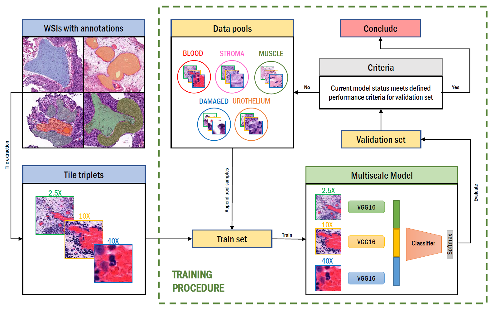

# ActiveLearning_TissueSegmentation

This is the source code described in the paper "Active Learning Based Domain Adaptation for Tissue Segmentation of Histopathological Images" by Saul Fuster, Farbod Khoraminia, Trygve Eftestøl, Tahlita C.M. Zuiverloon and Kjersti Engan - published on EUSIPCO 2023.

### 1 - Abstract
Accurate segmentation of tissue in histopathological images can be very beneficial  for defining regions of interest (ROI) for streamline of diagnostic and prognostic tasks. Still, adapting to different domains is essential for histopathology image analysis, as the visual characteristics of tissues can vary significantly across datasets. Yet, acquiring sufficient annotated data in the medical domain is cumbersome and time-consuming. The labeling effort can be significantly reduced by leveraging active learning, which enables the selective annotation of the most informative samples. Our proposed method allows for fine-tuning a pre-trained deep neural network using a small set of labeled data from the target domain, while also actively selecting the most informative samples to label next. We demonstrate that our approach performs with significantly fewer labeled samples compared to traditional supervised learning approaches for similar F1-scores, using barely a 59\% of the training set. We also investigate the distribution of class balance to establish annotation guidelines.

<p align="center">
    
</p>

### 2 - How to use

**Tile Extraction**: Tiles, or image patches, are extracted from your dataset at three different magnification levels. These tiles are typically extracted from Whole Slide Images (WSIs) and can be stored as image files or, as you mentioned, in TFRecord files. TFRecord is a binary format commonly used with TensorFlow for efficient data storage and retrieval. The `tfrecord_generator.py` script is responsible for creating TFRecord files from the extracted tiles. TFRecord files are optimized for fast data loading during training and inference in TensorFlow.

**Training with Active Learning**: You use the `active_learning_train.py` script to train your active learning model. Active learning is a machine learning approach where the model selects which data points (or in this case, tiles) to learn from next. This is typically used when labeling data is expensive or time-consuming.

**Inference with Active Learning**: After training, you can use the `active_learning_inference.py` script to make predictions or decisions based on the active learning model. This can include tasks like classification or selecting the most informative tiles for further annotation.

**Dependencies:** Ensure that you have the required dependencies listed in the `requirements.txt` file.

### 3 - Link to paper
https://ieeexplore.ieee.org/document/10290058

### 4 - How to cite our work
The code is released free of charge as open-source software under the GPL-3.0 License. Please cite our paper if you use it in your research.
```
@inproceedings{fuster2023active,
  title={Active Learning Based Domain Adaptation for Tissue Segmentation of Histopathological Images},
  author={Fuster, Saul and Khoraminia, Farbod and Eftest{\o}l, Trygve and Zuiverloon, Tahlita CM and Engan, Kjersti},
  booktitle={2023 31st European Signal Processing Conference (EUSIPCO)},
  pages={1045--1049},
  year={2023},
  organization={IEEE}
}
```
